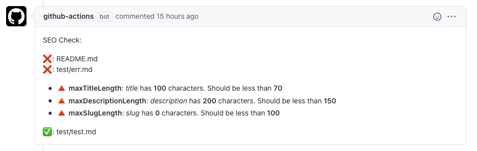

<p align="center">
  
</p>

<p align="center">
  <a href="https://github.com/zentered/markdown-seo-check/actions/workflows/seocheck.yml"></a>
  <a href="https://github.com/zentered/markdown-seo-check/actions/workflows/test.yml"></a>
  <a href="https://github.com/zentered/markdown-seo-check/actions/workflows/publish.yml"></a>
  <a href="https://semantic-release.gitbook.io/semantic-release/"></a>
  <a href="https://zentered.co">-Zentered-lightgrey?style=flat"></a>
</p>

# Markdown SEO Check

Validate markdown files with SEO best practices. Creates a pull request comment and fails if conditions are not met.

## Table of Contents

- [Usage](#usage)
- [Inputs](#inputs)
- [Outputs](#outputs)

## Usage

If your repo is public and you have pull requests from forks, `pull_request_target` is required, as this Action creates a comment on a Pull Request and therefore requires read/write permissions. Read more about the `pull_request_target` trigger [here](https://securitylab.github.com/research/github-actions-preventing-pwn-requests). If your repo is private, you can change this to `pull_request` and remove the `ref` in the checkout action.

```yaml
name: check

on: pull_request_target

jobs:
  seocheck:
    name: Markdown SEO Check
    runs-on: ubuntu-latest
    steps:
      - uses: actions/checkout@v2
        with:
          ref: ${{ github.event.pull_request.head.sha }}
      - name: Markdown SEO Check
        uses: zentered/markdown-seo-check@v1.1.0
        with:
          max_title_length: 70
          max_description_length: 150
          max_slug_length: 100
        env:
          GITHUB_TOKEN: ${{ secrets.GITHUB_TOKEN }}
```

## Inputs

| Name                     | Requirement | Default        | Description                                                                                                                             |
| ------------------------ | ----------- | -------------- | --------------------------------------------------------------------------------------------------------------------------------------- |
| `includes`               | optional    | `{*.md,*.mdx}` | Glob to include specific files or folders. See [glob-to-regexp usage](https://www.npmjs.com/package/glob-to-regexp#usage) for examples. |
| `excludes`               | optional    | ''             | Glob to exclude files or folders                                                                                                        |
| `max_title_length`       | required    | 70             | Maximum length of page title                                                                                                            |
| `max_description_length` | required    | 150            | Maximum length of description                                                                                                           |
| `max_slug_length`        | required    | 100            | Maximum length of slug                                                                                                                  |

## Outputs



## Contributing

See [CONTRIBUTING](CONTRIBUTING.md).

## License

See [LICENSE](LICENSE).
